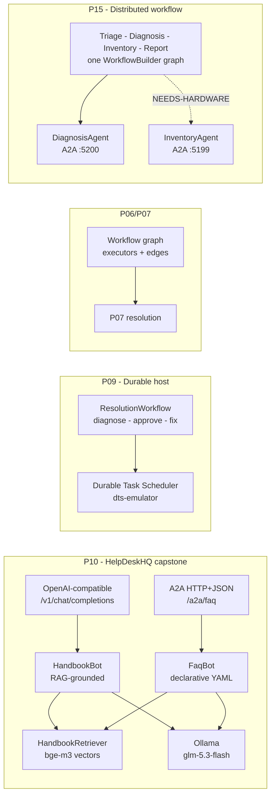

[](https://github.com/ihsanfarabi/microsoft-agent-framework-guide/actions/workflows/ci.yml)

# MafDemo — Microsoft Agent Framework curriculum

Fifteen projects that walk the Microsoft Agent Framework (MAF) from a one-file
chatbot to a durable multi-agent workflow — all on a local Ollama model, all
runnable end to end. Built against the 1.19.0 prerelease line; API
divergences from the docs are recorded in the field notes below.

## Architecture



## Projects

### Foundations (P01–P05) — one agent, one conversation, one tool, grounded and guarded

| # | Project | MAF feature | Highlights |
|---|---------|-------------|------------|
| 01 | `P01.HelloAgent` | `AIAgent` + `IChatClient` on Ollama | FAQ bot, OTLP telemetry, one-shot + REPL |
| 02 | `P02.TicketTools` | `[Description]` tool calling, MCP | Agent calls local C# ticket-store functions |
| 03 | `P03.SessionChat` | threads / sessions | Conversation survives process restart |
| 04 | `P04.HandbookRag` | RAG grounding | Chunk + embed handbook, context-provider injection |
| 05 | `P05.GuardrailMiddleware` | agent middleware | PII redaction, tool approval, OTel spans |

### Composition (P06–P08) — many agents, graphs, and an overnight harness

| # | Project | MAF feature | Highlights |
|---|---------|-------------|------------|
| 06 | `P06.TriageComposition` | agents-as-tools, handoffs | Triage router composes specialist agents |
| 07 | `P07.ResolutionWorkflow` | graph workflows | Executors, conditional edges, HITL, checkpoints |
| 08 | `P08.HarnessAgent` | agent harness | Todos, file memory, approvals — overnight batch agent |

### Production (P09–P15) — durable hosts, remote agents, and the seams where prerelease docs meet reality

| # | Project | MAF feature | Highlights |
|---|---------|-------------|------------|
| 09 | `P09.DurableHost` | durable workflows + A2A | Kill-and-resume on the DTS emulator, hosted A2A endpoint, client consuming it |
| 10 | `P10.HelpDeskCapstone` | everything together | OpenAI-compatible chat + A2A server + declarative YAML agents + RAG + evals + CI + compose |
| 11 | `P11.StructuredOutput` | typed `RunAsync<T>`, JSON response formats | Typed triage via `RunAsync<T>`, per-call vs raw format paths, schema-compliance probe + one-retry fallback |
| 12 | `P12.McpKnowledgeServer` | custom MCP server (`ModelContextProtocol` SDK) | Own stdio MCP server (`search_knowledge` over the handbook, token-overlap scorer) consumed by P02 alongside its filesystem server |
| 13 | `P13.StreamingApproval` | `UseToolApproval` round trip, SSE streaming | Self-hosted chat endpoint pauses mid-stream on destructive tool calls — an `event: approval` frame carries the request, a second POST votes, the same session resumes (`scripts/demo13.sh`) |
| 14 | `P14.SemanticMemory` | `ChatHistoryMemoryProvider` + custom `AIContextProvider` + MEVD vectors | Two memory shapes side by side: MAF's turn memory (cross-session, process-local) beside a durable fact store — a tiny extractor agent distills each turn to third-person facts, dedupes at cosine ≥ 0.9, persists to JSON, and a fresh process recalls them (`scripts/demo14.sh`) |
| 15 | `P15.OrchestratorHost` | graph workflows across remote A2A agents | One local `WorkflowBuilder` graph with two remote hops (DiagnosisAgent :5200, P09's InventoryAgent :5199) — a conditional edge on the diagnosis text skips the inventory hop, agent nodes are `ChatProtocol` executors (`List<ChatMessage>` + `TurnToken`, not `AgentResponse`), and killing the inventory service fails visibly at the hop as a `WorkflowErrorEvent`, never at startup (`scripts/demo15-failure.sh`) |

## Backlog — deliberately not built

The ladder is frozen at 15. These are verified-but-unbuilt ideas, kept here
as the visible not-built list. Each names the API or gap it would close; all
APIs were confirmed against the installed packages during the P11–P15 gap
scan.

| Item | Closes what | Where it would land |
|---|---|---|
| ~~HandbookCorpus consolidation~~ | 7 hand-rolled handbook loaders across projects drift independently | **Done** — `HandbookCorpus.Locate()` in `MafDemo.Core`, 7 copies collapsed (P04, P06, P07, P08, P09, P10, P12) |
| Static demo page | No viewer-friendly UI; approval flow is curl-only | 1-hour HTML page over P10's chat endpoint — outside the ladder, no project |
| MEAI Evaluation port | Eval harness is hand-rolled in `MafDemo.Core` | Port to `Microsoft.Extensions.AI.Evaluation` 10.9.0 `DiskBasedReportingConfiguration` (response-cached evals) |
| Multi-model routing | Single fixed model per project | MEAI `SemanticRoutingChatClient` / `OrderedFailoverChatClient` / `ConfigureOptionsChatClient`; MAF `RoutePersistingRoutingChatClient` |
| Cross-process trace propagation | P15 NOTES claims "three processes in one trace" — spans are per-process today; no W3C traceparent propagation across the A2A hops | P15 orchestrator + services: propagate `Activity.Current` context into outbound A2A calls |
| Endpoint hardening | P13/P10 endpoints are unauthenticated, unthrottled demo surfaces | API-key middleware + rate limit on the P13 SSE endpoint |
| Compaction | Long sessions grow unbounded | MAF `Compaction.*` APIs on the capstone host |
| Vision | All text; models support it | Image input through P10's chat path |
| Declarative YAML workflows | P10 has declarative agents, not declarative graphs | Deferred at MAF 1.19.0 — feature ships in 1.20.0; revisit on package bump |

## Run

Prereqs: .NET 10 SDK, [Ollama](https://ollama.com) with the models from
`appsettings.json` (`glm-5.3-flash:cloud`, `bge-m3`).

Capstone (one command, includes the Aspire dashboard at http://localhost:18888):

```bash
ollama serve   # if not already running
docker compose up --build
curl -s http://localhost:5080/v1/chat/completions -H 'Content-Type: application/json' \
  -d '{"model":"HandbookBot","messages":[{"role":"user","content":"How do I reset my password?"}]}'
```

Any single project:

```bash
dotnet run --project src/P01.HelloAgent            # every project: P01..P15
RUN_EVALS=1 dotnet test tests/MafDemo.Core.Tests --filter EvalSuite
scripts/demo13.sh                                  # P13 live approval demo (curl SSE)
scripts/demo14.sh                                  # P14 two-process memory demo (tell, quit, recall)
scripts/demo15-failure.sh                          # P15 kill-service demo (dead A2A hop fails visibly)
```

Durable resume (P09): start the dts-emulator container, run the host, interrupt
it mid-approval, then `dotnet run -- resume` — pending work re-runs from
scheduler state.

## Layout

- `src/P*` — one or more folders per curriculum project (multi-service
  projects get one folder per service: P09 and P15 have three and two);
  `MafDemo.Core` holds shared
  handbook corpus loading, chunking, and the eval harness.
- `docs/corpus` — the MafCorp handbook markdown the RAG projects index.
- `Definitions/` (inside P10) — declarative YAML agent definitions (`Agents/`
  would case-insensitively collide with the C# source folder on macOS).
- `.github/workflows/ci.yml` — build + unit tests on push; eval suite gated to
  manual dispatch (needs live Ollama).
