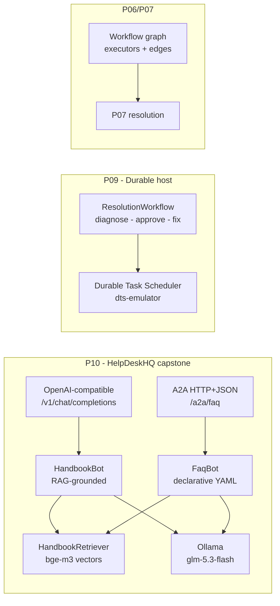

[](https://github.com/ihsanfarabi/maf-demo/actions/workflows/ci.yml)

# MafDemo — Microsoft Agent Framework curriculum

Eleven projects that walk the Microsoft Agent Framework (MAF) from a one-file
chatbot to a durable multi-agent workflow — all on a local Ollama model, all
runnable end to end. Built against the 1.19.0 prerelease line; API
divergences from the docs are recorded per project in `docs/projects/*/NOTES.md`.

## Architecture



## Projects

| # | Project | MAF feature | Highlights |
|---|---------|-------------|------------|
| 01 | `P01.HelloAgent` | `AIAgent` + `IChatClient` on Ollama | FAQ bot, OTLP telemetry, one-shot + REPL |
| 02 | `P02.TicketTools` | `[Description]` tool calling, MCP | Agent calls local C# ticket-store functions |
| 03 | `P03.SessionChat` | threads / sessions | Conversation survives process restart |
| 04 | `P04.HandbookRag` | RAG grounding | Chunk + embed handbook, context-provider injection |
| 05 | `P05.GuardrailMiddleware` | agent middleware | PII redaction, tool approval, OTel spans |
| 06 | `P06.TriageComposition` | agents-as-tools, handoffs | Triage router composes specialist agents |
| 07 | `P07.ResolutionWorkflow` | graph workflows | Executors, conditional edges, HITL, checkpoints |
| 08 | `P08.HarnessAgent` | agent harness | Todos, file memory, approvals — overnight batch agent |
| 09 | `P09.DurableHost` | durable workflows + A2A | Kill-and-resume on the DTS emulator, hosted A2A endpoint, client consuming it |
| 10 | `P10.HelpDeskCapstone` | everything together | OpenAI-compatible chat + A2A server + declarative YAML agents + RAG + evals + CI + compose |
| 11 | `P11.StructuredOutput` | typed `RunAsync<T>`, JSON response formats | Typed triage via `RunAsync<T>`, per-call vs raw format paths, schema-compliance probe + one-retry fallback |

## Run

Prereqs: .NET 10 SDK, [Ollama](https://ollama.com) with the models from
`appsettings.json` (`glm-5.3-flash:cloud`, `bge-m3`).

Capstone (one command, includes the Aspire dashboard at http://localhost:18888):

```bash
ollama serve   # if not already running
docker compose up --build
curl -s http://localhost:5080/v1/chat/completions -H 'Content-Type: application/json' \
  -d '{"model":"HandbookBot","messages":[{"role":"user","content":"How do I reset my password?"}]}'
```

Any single project:

```bash
dotnet run --project src/P01.HelloAgent            # every project: P01..P10
RUN_EVALS=1 dotnet test tests/MafDemo.Core.Tests --filter EvalSuite
```

Durable resume (P09): start the dts-emulator container, run the host, interrupt
it mid-approval, then `dotnet run -- resume` — pending work re-runs from
scheduler state. Full walkthrough in `docs/projects/09-a2a-durable/NOTES.md`.

## Layout

- `src/P*` — one folder per curriculum project; `MafDemo.Core` holds shared
  handbook corpus loading, chunking, and the eval harness.
- `docs/corpus` — the MafCorp handbook markdown the RAG projects index.
- `docs/projects/<n>-*/PLAN.md` — per-project learning plan, `NOTES.md` —
  findings and doc-vs-reality divergences.
- `Definitions/` (inside P10) — declarative YAML agent definitions (`Agents/`
  would case-insensitively collide with the C# source folder on macOS).
- `.github/workflows/ci.yml` — build + unit tests on push; eval suite gated to
  manual dispatch (needs live Ollama).
